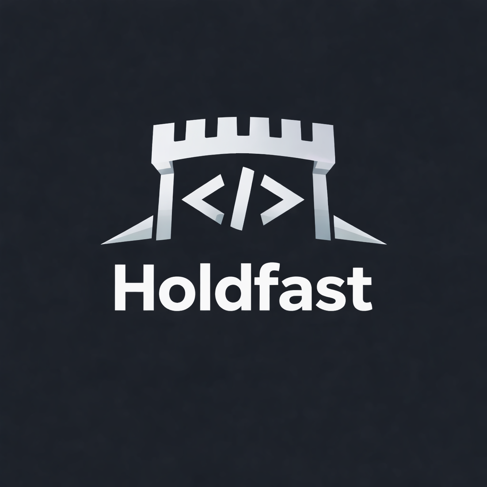

<p align="center">
  
</p>

<h1 align="center">Holdfast</h1>

<p align="center"><strong>Governed evolution for LLM and agentic systems.</strong></p>

The destination is fixed. The route gets better.

Holdfast separates what your downstream systems depend on (frozen) from how you deliver it (evolvable), then uses evidence from real runs to improve the route while guaranteeing the destination doesn't change. Built for teams running LLM pipelines, agentic workflows, and prompt-driven systems that need to improve without breaking contracts.

## Built for Claude Code & Python pipelines

### Claude Code

Use Claude Code the way you already do — build pipelines, iterate on prompts, run agents. Holdfast sits underneath, collecting evidence from real runs and detecting when things drift.

When something needs attention, Claude interprets the accumulated evidence, explains what's happening and why, and proposes a bounded change. You approve before anything changes.

- **Build** — write your pipeline, prompts, and agents with Claude Code as usual
- **Interpret** — ask Claude to read your evidence, spot failure patterns, explain what's drifting across runs
- **Evolve** — Claude proposes a targeted fix backed by specific run evidence, you approve, the prompt evolves

**Before:** Your classifier prompt doesn't handle sarcasm. 5 of the last 20 runs fail on ambiguous tone — but you don't know that until something breaks downstream.

**After:** Holdfast detects the pattern. Claude explains the cluster of failures, proposes adding a single instruction for ambiguous inputs, you approve, and the prompt evolves. The frozen output schema is never touched.

### Python pipelines

The Python library instruments your pipeline and collects evidence. Wire `@track` into your functions, and holdfast logs every run, validates against invariants, and detects drift — giving Claude (or your own LLM) the data it needs to propose improvements.

```python
from holdfast import Contract, track

contract = Contract.load("holdfast/contracts/my-pipeline/")

@track(contract)
async def classify(item: dict) -> dict:
    prompt = contract.get_evolvable("prompt")
    return await your_llm_call(prompt, item)

# Every call logs evidence. Pass/fail determined by invariant validation.
# Evolution proposals are backed by this accumulated evidence.
```

For CI or fully automated pipelines, `propose_evolution()` drives evolution programmatically without Claude Code.

## What it looks like

A typical Claude Code session with holdfast:

```
You: Anything drifting in my classifier contract?

Claude: Looking at 47 runs across the last week.

  3 alerts:
  - score variance on 'confidence' field (stddev=0.89, threshold 0.5)
  - failure rate 37% in last 10 runs (threshold 20%)
  - 5 of 8 failures are missing confidence on ambiguous inputs (sarcasm, irony)

  The failures cluster around tone-ambiguous inputs where the model
  skips the confidence field entirely. The prompt doesn't mention
  how to handle ambiguous cases.

You: Propose an evolution.

Claude: Based on runs 005, 006, 008, 012, 014 — all failures on ambiguous tone:

  Proposed change to evolvable/prompt.md:
  + For ambiguous inputs (sarcasm, irony, mixed signals), always include
  + a confidence score. Use lower confidence (0.3-0.5) but never omit the field.

  This preserves the frozen output schema (label + confidence required)
  and targets the specific failure pattern. Want me to apply it?

You: Yes.

Claude: Applied evolution evo-001 (v1 → v2). Previous version snapshotted —
  rollback to v1 anytime with rollback(contract, to_version=1).
```

## Install

```bash
pip install holdfast
```

Install the Claude Code skill for interactive evolution:

```bash
# Via plugin (recommended)
/plugin add kevintelford/holdfast

# Or manually
mkdir -p ~/.claude/skills/holdfast
cp skills/holdfast/SKILL.md ~/.claude/skills/holdfast/SKILL.md
```

## Quick start — Claude Code

Once you have a contract set up (see [Python API quick start](#quick-start--python-api) for setup), everything is conversational:

**Check for patterns:**
> "What patterns do you see in my classifier contract?"

**Propose an evolution:**
> "Evolve the classifier prompt based on the last 20 runs."

**Check drift:**
> "Anything drifting in the classifier?"

**Review history:**
> "Show me the evolution history for the classifier."

Claude reads evidence, analyzes patterns, and proposes bounded edits to evolvable surfaces. Frozen surfaces are never touched. You approve before anything changes.

## Quick start — Python API

The Python API handles contract setup, evidence logging, and can drive evolution programmatically for CI/automation.

### 1. Create a contract

By convention, contracts live under `holdfast/contracts/` in your project root:

```
holdfast/
  contracts/
    my-pipeline/
    ├── contract.yaml
    ├── frozen/
    │   └── output_schema.json
    ├── evolvable/
    │   └── prompt.md
    ├── invariants.yaml
    └── detection.yaml          # optional — pattern detection rules
```

**contract.yaml:**
```yaml
name: my-pipeline
version: 1
evolution_mode: monitor     # monitor | semi-auto | auto

frozen:
  output_schema: "frozen/output_schema.json"

evolvable:
  prompt: "evolvable/prompt.md"
```

### 2. Log evidence

```python
from holdfast import Contract, log_run

contract = Contract.load("holdfast/contracts/my-pipeline/")
prompt = contract.get_evolvable("prompt")

result = your_llm_call(prompt, data)

log_run(contract=contract, output=result, passed=validate(result))
```

Or use the decorator:

```python
from holdfast import Contract, track

contract = Contract.load("holdfast/contracts/my-pipeline/")

@track(contract)
def classify(item: dict) -> dict:
    prompt = contract.get_evolvable("prompt")
    # ... your LLM call ...
    return result

# Each call logs evidence. Pass/fail determined by invariant validation.
```

The `@track` decorator also works with async functions:

```python
@track(contract)
async def classify(item: dict) -> dict:
    ...
```

### 3. Monitor for patterns

```bash
python -m holdfast status holdfast/contracts/my-pipeline/
# Contract: my-pipeline (v1, mode: monitor)
# Evidence: 47 runs (42 passed, 5 failed)
# Alerts: 1 — score variance on 'score' (stddev=0.89)
```

Or in Python:

```python
from holdfast import Contract, check_contract

contract = Contract.load("holdfast/contracts/my-pipeline/")
alerts = check_contract(contract)
```

### 4. Evolve programmatically

For `auto` mode or CI pipelines where you want evolution without interactive review:

```python
from holdfast import Contract, propose_evolution, apply_evolution

contract = Contract.load("holdfast/contracts/my-pipeline/")
proposal = propose_evolution(contract=contract, llm=my_llm_callable, min_runs=10)

if proposal:
    print(proposal.diff)
    print(proposal.rationale)
    apply_evolution(contract=contract, proposal=proposal)
```

### 5. Rollback if needed

```python
from holdfast import Contract, rollback, list_versions

contract = Contract.load("holdfast/contracts/my-pipeline/")
versions = list_versions(contract)  # [1, 2, 3]
rollback(contract, to_version=2)
```

## Evolvable references

Evolvable surfaces can reference standalone files or Python symbols in existing source files.

### File references (default)

```yaml
evolvable:
  prompt: "evolvable/prompt.md"
```

Reads and writes the entire file.

### Source references (Python symbols)

Point directly at string constants in your source code — no need to extract prompts into separate files:

```yaml
evolvable:
  system_prompt:
    path: "src/pipeline/prompts.py"
    symbol: "SYSTEM_PROMPT"              # module-level assignment

  maturity_prompt:
    path: "src/pipeline/prompts.py"
    symbol: "CyberPrompts.MATURITY_PROMPT"  # class attribute
```

Supports:
- **Module-level assignments**: `PROMPT = "..."` — symbol is `"PROMPT"`
- **Class attributes**: `class Foo: PROMPT = "..."` — symbol is `"Foo.PROMPT"`

Holdfast uses `ast.parse()` for extraction — no code execution. Write-back preserves all surrounding code and original quoting style.

Both formats can be mixed in the same contract. `get_evolvable()` returns the string value regardless of format.

## Contracts

A contract separates outcome (frozen) from method (evolvable):

- **Frozen surface**: output schemas, response formats, scoring scales, coding standards. Protected.
- **Evolvable surface**: prompts, examples, reasoning instructions. Improves from evidence.
- **Invariants** (`invariants.yaml`): automated checks that must pass before and after changes.
- **Detection rules** (`detection.yaml`): pattern detection across runs (variance, drift, failure rate).

### Evolution modes

| Mode | Behavior |
|---|---|
| `monitor` | Detect and alert only. Default. |
| `semi-auto` | Detect, propose, human approves. |
| `auto` | Detect, propose, apply if invariants pass. |

Set in `contract.yaml` as `evolution_mode`. Graduate when you trust the contract.

### Invariant types

| Type | What it checks |
|---|---|
| `schema` | JSON Schema validation against a frozen schema file |
| `contains` | Field value is one of the allowed values (scalar) or contains all required values (list) |
| `custom` | External Python script — passes output as JSON on stdin, checks exit code |

See [Security considerations](#security-considerations) for custom script trust model.

### Detection rule types

| Type | What it detects |
|---|---|
| `variance` | Field values vary too much within a window. Optional `group_by` to check per-group (e.g. per question). |
| `drift` | Field average shifted between baseline and recent windows |
| `failure_rate` | Too many failed runs in a window |

Detection rules operate on a sliding window of recent evidence. Runs outside the window are ignored — they're not deleted, just not considered for detection. If you have 500 runs and a `window: 100`, only the most recent 100 runs are checked. Baseline windows (for drift) work the same way, looking at an earlier slice.

### Contract patterns

For projects with multiple pipelines or variants, organize contracts by use case:

```
holdfast/
  contracts/
    classifier/
      en/             # English language classifier
      es/             # Spanish language classifier
    summarizer/
      short-form/     # Tweet-length summaries
      long-form/      # Executive summaries
```

Each contract gets its own evidence pool and detection rules. If multiple contracts share the same frozen schema and invariants, duplicate the files — contract inheritance is not yet supported.

## Storage

Everything is flat files in `.holdfast/` inside each contract directory:

```
.holdfast/
├── evidence/     # JSON files, one per run
└── versions/     # snapshots + evolution records
```

Human-readable, greppable, no database.

### Gitignore

Add this to your project's `.gitignore`:

```
**/.holdfast/
```

Evidence and version snapshots are managed state, not source. They can get large with many runs. If you want to track them (e.g., for team review of evidence), remove this line — the files are plain JSON and git handles them fine.

## Security considerations

### Custom invariant scripts

Custom scripts execute as the current user via `subprocess.run()` with full filesystem access. The only guard is a 30-second timeout. Script paths are validated to stay within the contract root (or `project_root` if set). This is fine for local development and CI where you control the scripts. Review any custom scripts before trusting third-party contracts.

### Evidence data sensitivity

Evidence files (`.holdfast/evidence/*.json`) store the full output of each run in plaintext. Do not pass sensitive data — API keys, PII, auth tokens, credentials — through `log_run()` or `@track`. If your pipeline output contains sensitive fields, strip them before logging.

### Evolution in auto mode

In `auto` mode, evolution proposals are applied without human review if invariants pass. The proposal content comes from an LLM and is written directly to evolvable files. Use `monitor` or `semi-auto` mode for contracts where unreviewed changes could have security impact. Reserve `auto` for low-risk contracts where invariant checks provide sufficient guardrails.

### Prompt injection via evidence

Evolution proposals are generated by feeding accumulated evidence into an LLM prompt. If an attacker can control `input_summary`, `notes`, or `output` fields passed to `log_run()`, they could influence the LLM's proposal. Validate evidence inputs at your application boundary — holdfast logs what you give it.

## Inspired by

[Memento-Skills](https://arxiv.org/abs/2603.18743) (Zhou et al., 2026) demonstrated that agents can improve by evolving external artifacts rather than retraining models. Holdfast applies that insight with governance — frozen contracts, invariant validation, audit trails, and graduated trust levels for enterprise pipelines.

## License

MIT
